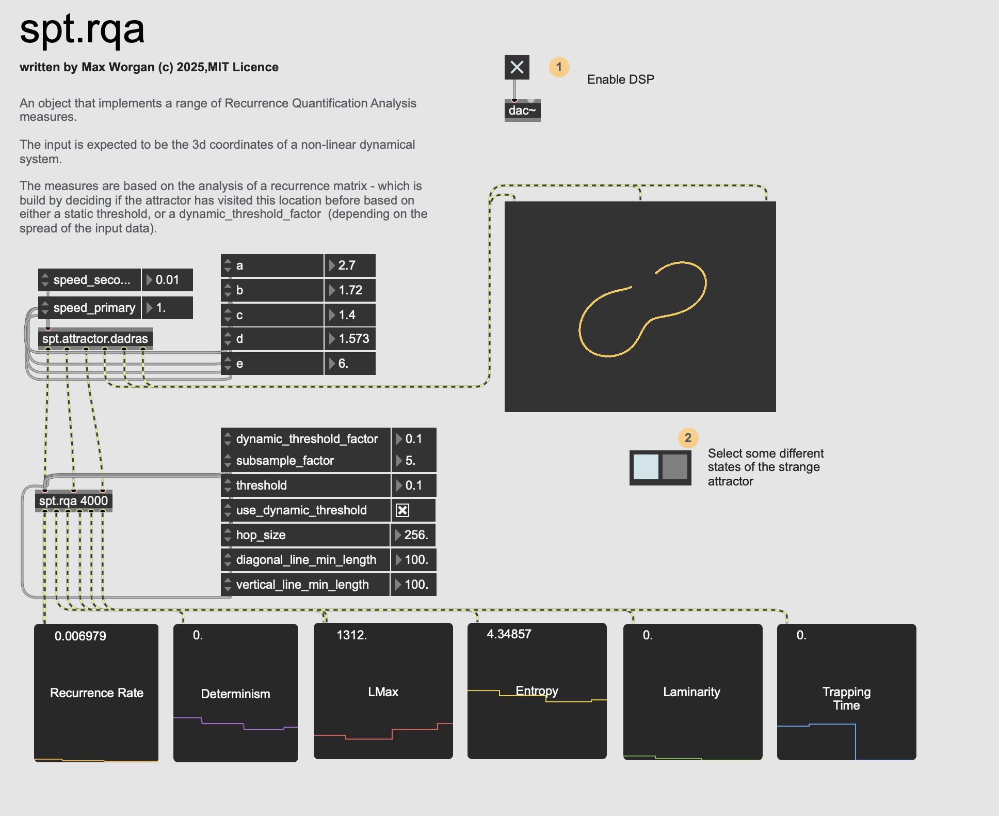
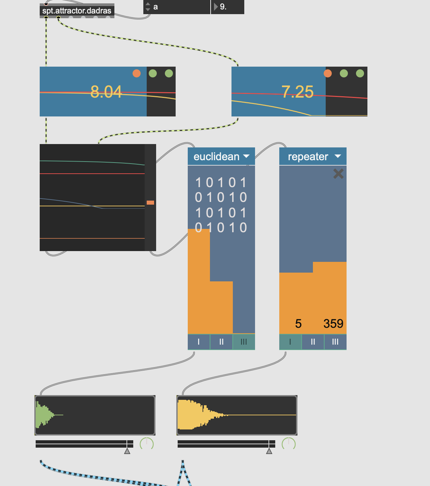
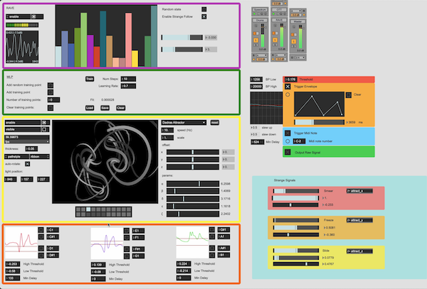

# Strange Pulse Toolkit


The Strange Pulse Toolkit (SPT) is a collection of Max/MSP externals, patchers, and snippets for embedding strange attractors into your patches. It emphasises exploration and experimentation and focuses mainly on the rhythmic potential of strange attractors.






---

## Highlights


- **Strange attractor generators:** Lorenz, Dadras, and Thomas attractors as MSP externals with dual, syncable trajectories and RK4/Euler integration.
- **Recurrence analysis:** `spt.rqa` and `spt.rpde` provide real-time recurrence metrics for adaptive feedback or complexity measurement.
- **Rhythm utilities:** Patchers for generating triggers or gates from signals, gate logic, Euclidean rhythms, and arithmetic/quantized rhythm modifiers.
- **Signal shaping and display:** Scaling, inversion, folding, smoothing, band-pass filtering, recurrence plots, and attractor visualization helpers.
- **Feedback building blocks:** Audio feedback patchers plus recurrence-driven control utilities for self-monitoring instruments.

---

## Getting started

1) **Install the package**  
Clone (with submodules) directly into your Max Packages folder, or download and drop it there:
```bash
git clone --recurse-submodules https://github.com/MaxWorgan/StrangePulseToolkit.git "StrangePulseToolkit"
```
Max should pick up the package on restart; the externals live in `externals/`.

2) **Explore the overview**  
Open `extras/spt-Overview.maxpat` to jump to the attractor, rhythm, signal-shaping, and feedback patchers.

3) **Play with the demos**  
Open `patchers/demo1.maxpat`  and `patchers/demo2.maxpat` to see examples of the kinds of instruments you can create. Hack them and adapt to your taste.

---

## Building the externals

The repository already ships with macOS builds in `externals/`. To rebuild:

```bash
cmake -S . -B build -G "Xcode"      # or "Ninja"/"Unix Makefiles" on other platforms
cmake --build build --config Release
```

- Requires CMake ≥ 3.19 and a supported compiler (Xcode on macOS, Visual Studio on Windows).
- Binaries land in `externals/`. Clean the build tree with `rm -rf build` if you need a fresh configuration.


## License and credits

MIT License, © 2025 Max Worgan. See `License.md` for details.
