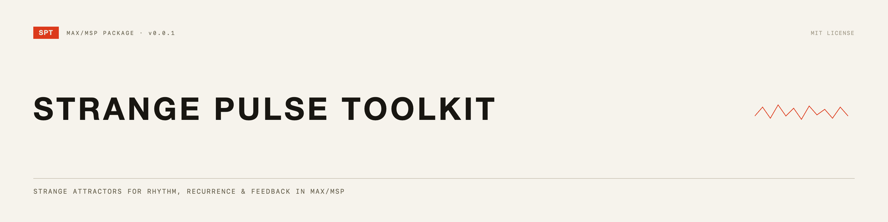
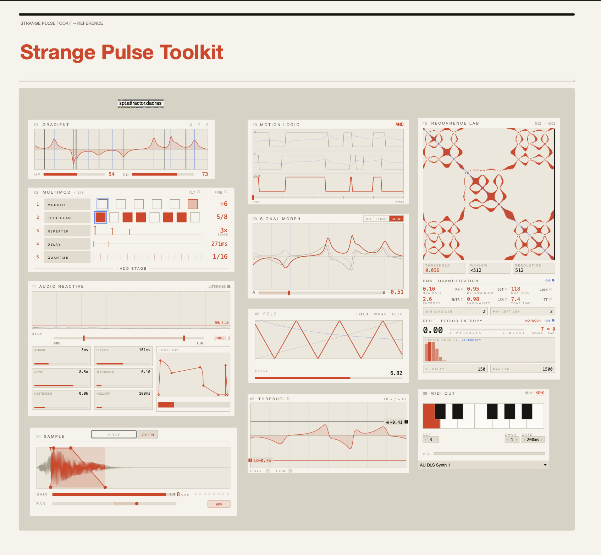

<p align="center">
  
</p>

<p align="center">
  <a href="License.md"></a>
  
  
  
</p>

A collection of Max/MSP externals, patchers, and snippets for embedding strange attractors into your patches. Strange Pulse Toolkit (SPT) is built for exploration — it focuses on the rhythmic potential of strange attractors, real-time recurrence analysis, and the feedback structures they enable.

---

## Highlights

- **Strange attractor generators** — Lorenz, Dadras, Thomas, Aizawa, Halvorsen, and TSUCS1 as MSP externals, each with dual syncable trajectories and RK4/Euler integration.
- **Recurrence analysis** — `spt.rqa` and `spt.rpde` compute real-time recurrence metrics for adaptive feedback or complexity measurement.
- **Rhythm utilities** — patchers for deriving triggers and gates from signals, gate logic, Euclidean rhythms, and quantized rhythm modifiers.
- **Signal shaping and display** — scaling, inversion, folding, smoothing, band-pass filtering, recurrence plots, and attractor visualization helpers.
- **Feedback building blocks** — audio feedback patchers plus recurrence-driven control utilities for self-monitoring instruments.

---

## Module board

The toolkit ships various UI modules covering triggers, signal shaping, sampling, and analysis.

<p align="center">
  
</p>


## Getting started

**1. Install the package**

Clone (with submodules) directly into your Max Packages folder, or download and drop it there:

```bash
git clone --recurse-submodules https://github.com/MaxWorgan/StrangePulseToolkit.git "StrangePulseToolkit"
```

Max should pick up the package on restart; the externals live in `externals/`.

**2. Explore the overview**

Open `extras/spt-Overview.maxpat` to jump to the signal generators, rhythm, signal-shaping, feedback, and display patchers.

**3. Play with the demos**

Open `patchers/demos.maxpat` for an index of five demos — sample ensembles, a wavetank feedback patch, a RAVE latent mapping, and external MIDI. Each is a working instrument; hack them and adapt to your taste.

---

## Building the externals

The repository already ships with macOS builds in `externals/`. To rebuild:

```bash
cmake -S . -B build -G "Xcode"      # or "Ninja" / "Unix Makefiles" on other platforms
cmake --build build --config Release
```

- Requires CMake ≥ 3.19 and a supported compiler (Xcode on macOS, Visual Studio on Windows).
- Binaries land in `externals/`. Clean the build tree with `rm -rf build` if you need a fresh configuration.

---

## License and credits

MIT License, © 2025–2026 Max Worgan. See [`License.md`](License.md) for details.
